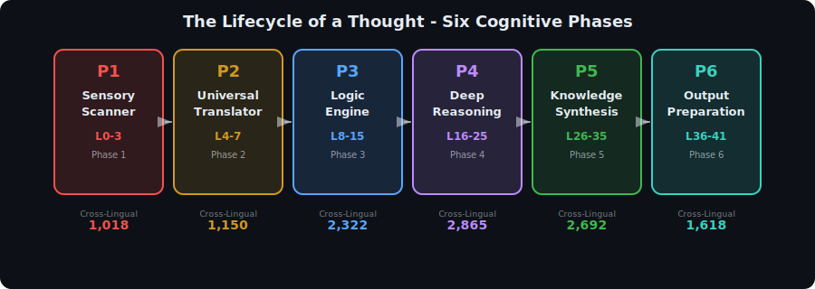
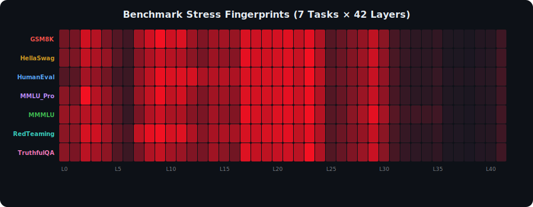
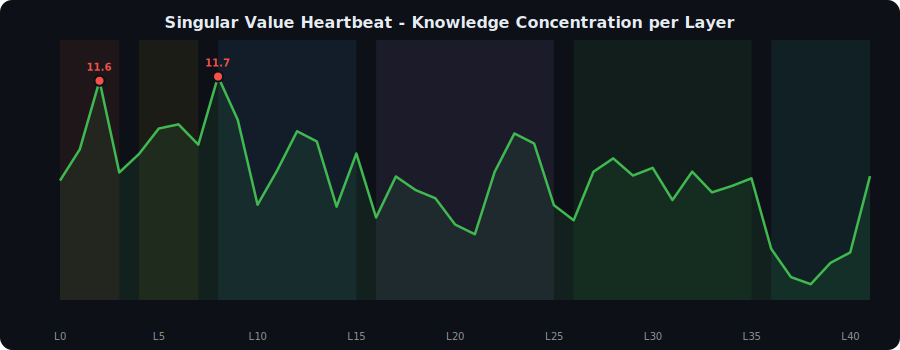
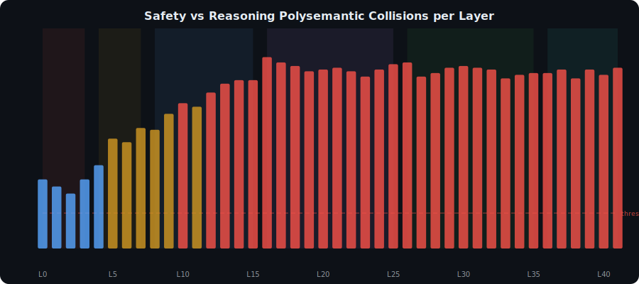
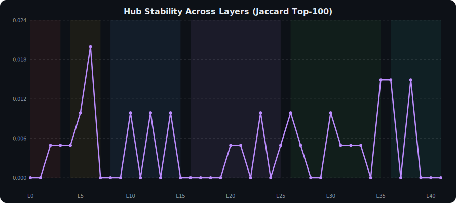
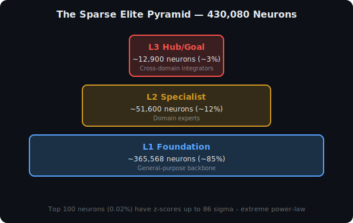

<p align="center">
  
</p>

<h1 align="center">
  MetaPlex
</h1>

<h3 align="center">
  Decoding the Cognitive Architecture of Google's Gemma-4-E4B<br/>
  <sub>430,080 neurons mapped. 42 layers decoded. 7 benchmarks fingerprinted.</sub>
</h3>

<p align="center">
  <a href="https://huggingface.co/datasets/itz-mohana/gemma4-neurocartography"></a>
  <a href="RESEARCH_PAPER.md"></a>
  
  
</p>

---

## What is MetaPlex?

**MetaPlex** is the first complete structural audit of a 4-billion parameter large language model. We individually characterized **every single FFN neuron** in Google's `gemma-4-E4B-it` model using SVD decomposition and benchmark-specific Z-scoring.

> *Imagine having an fMRI scan of every neuron in the human brain, labeled by function, organized by region, and stress-tested against 7 different cognitive tasks. That's what MetaPlex is -- for an AI.*

---

## Key Discoveries

<table>
  <tr>
    <td width="50%">

### The Six-Phase Lifecycle

Every thought the model processes travels through **six distinct cognitive phases**, from raw character scanning to final output preparation.

| Phase | Layers | Function |
|---|---|---|
| 1. Sensory Scanner | 0-3 | Raw token reading |
| 2. Universal Translator | 4-7 | Language-agnostic meaning |
| 3. Logic Engine | 8-15 | Syntax and reasoning |
| 4. Deep Reasoning | 16-25 | Multi-step thinking |
| 5. Knowledge Synthesis | 26-35 | Cross-domain integration |
| 6. Output Preparation | 36-41 | Response generation |

</td>
<td width="50%">

### The Sparse Elite Pyramid

Only **3% of neurons** control the model's cross-domain reasoning. The rest are general-purpose backbone.

| Tier | % | Role |
|---|---|---|
| **Hub/Goal** | ~3% | Cross-domain integrators |
| **Specialist** | ~12% | Domain experts |
| **Foundation** | ~85% | General backbone |

**The apex neuron** (Layer 38, #7305) has a z-score of **-86.72** across all 7 benchmarks -- the most extreme neuron in the entire network.

</td>
  </tr>
</table>

---

## Visualizations

### Benchmark Stress Fingerprints
*Each benchmark activates a unique pattern, proving the model routes different tasks through different cognitive pathways.*

<p align="center">
  
</p>

### The Singular Value Heartbeat
*Knowledge concentration shows a distinctive "heartbeat" with peaks at Layer 2, Layer 8, and Layer 41.*

<p align="center">
  
</p>

### Safety vs Reasoning Polysemantic Collisions
*Every layer has 20+ shared top hubs between safety and reasoning tasks. By Phase 4, over 100 neurons are doing both jobs simultaneously.*

<p align="center">
  
</p>

### Hub Stability
*Hub neurons do not persist across layers. The near-zero Jaccard similarity proves that thoughts move through relay chains, not static neurons.*

<p align="center">
  
</p>

---

## The Critical Safety Finding

> **The strongest reasoning neurons ARE the strongest safety neurons.**

Our polysemantic binding analysis shows that removing or modifying safety-critical neurons would simultaneously destroy reasoning capability:

| Neuron | Reasoning Z-Score | Safety Z-Score | Binding Strength |
|---|---|---|---|
| (38, 7305) | 86.23 | 86.72 | **86.23** |
| (36, 4744) | 84.83 | 85.48 | **84.83** |
| (32, 552) | 79.39 | 74.80 | **74.80** |

This means **surgical ablation for AI safety is not feasible** at the neuron level. Safety and capability are fundamentally entangled in the model's architecture.

---

## Dataset

The full 17GB raw dataset is available on HuggingFace:

**[itz-mohana/gemma4-neurocartography](https://huggingface.co/datasets/itz-mohana/gemma4-neurocartography)**

| Component | Files | Description |
|---|---|---|
| `svd/` | 42 `.npz` | Weight matrix SVD decompositions |
| `basis_projection/` | 42 CSVs | Neuron-to-concept alignment maps |
| `benchmarks/` | 294 CSVs | Z-scores across 7 benchmarks |
| `synthesis/` | 3 CSVs | Neuron hierarchy, hub nodes, polysemantic report |
| `architecture/` | 1 JSON | Model structure description |

---

## Quick Start

```bash
# Clone this repo
git clone https://github.com/mkrishna793/MetaPlex.git
cd MetaPlex

# Download the dataset (requires ~17GB)
pip install huggingface_hub
huggingface-cli download itz-mohana/gemma4-neurocartography --local-dir ./data

# Run the analysis
pip install pandas numpy matplotlib
python analyze_all_layers.py
python phase2_benchmark_engine.py

# Generate visualizations
python generate_visuals.py
```

---

## Repository Structure

```
MetaPlex/
  visuals/                          # SVG visualizations
    lifecycle_phases.svg            # Six-phase cognitive lifecycle
    benchmark_heatmap.svg           # 7x42 benchmark stress fingerprints
    sv_heartbeat.svg                # Singular value concentration curve
    polysemantic_collisions.svg     # Safety-reasoning collision counts
    hub_stability.svg               # Hub neuron Jaccard similarity
    cognitive_stress.svg            # Mean |Z| across layers
    neuron_pyramid.svg              # Three-tier neuron hierarchy
  RESEARCH_PAPER.md                 # Full research paper (15+ pages)
  analyze_all_layers.py             # Phase 1: Concept map decoder
  phase2_benchmark_engine.py        # Phase 2: Benchmark fingerprinting
  generate_visuals.py               # SVG visualization generator
  layer_XX_neuron_zscores.csv       # Raw z-score data (42 files)
  LICENSE                           # GPL-3.0
```

---

## Full Research Paper

Read the complete technical paper with all 7 discoveries explained in detail:

**[RESEARCH_PAPER.md](RESEARCH_PAPER.md)**

---

## Part I: The Mechanics of Intelligence

MetaPlex is **Part II** of the NeuroCartography Research Series. Part I studied 6 different models (7B-35B parameters) and discovered the foundational laws:

**[The Mechanics of Intelligence](https://github.com/mkrishna793/The-Mechanics-of-Intelligence)** -- WeightScript framework, Polysemantic Binding, cDoS vulnerability class, and the Four Laws of Neural Architecture.

| Aspect | Part I (Mechanics) | Part II (MetaPlex) |
|---|---|---|
| **Focus** | Cross-model comparison (6 models) | Single-model deep dive (Gemma-4-E4B) |
| **Scale** | 1 layer per model, 2000 nodes | All 42 layers, 430,080 neurons |
| **Key Discovery** | Polysemantic Binding + cDoS | Hub Handoff Chains + Safety Entanglement |

---

## Citation

```bibtex
@misc{metaplex2026,
  title={MetaPlex: Decoding the Cognitive Architecture of Gemma-4-E4B},
  author={M. Bhanu Krishna},
  year={2026},
  publisher={GitHub},
  url={https://github.com/mkrishna793/MetaPlex},
  dataset={https://huggingface.co/datasets/itz-mohana/gemma4-neurocartography}
}
```

---

<p align="center">
  
</p>

<p align="center">
  <b>MetaPlex</b> -- Mapping every neuron, decoding every thought.<br/>
  <sub>Built by M. Bhanu Krishna | 2026</sub>
</p>