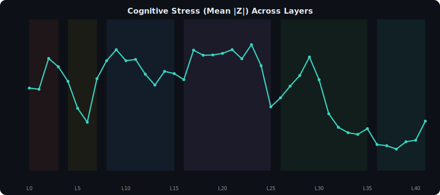

<p align="center">
  
</p>

<h1 align="center">MetaPlex: Decoding the Cognitive Architecture of Gemma-4-E4B</h1>

<p align="center">
  <b>A Complete Neurocartography of 430,080 Neurons Across 42 Layers and 7 Benchmarks</b><br/>
  <i>M. Bhanu Krishna &bull; April 2026</i>
</p>

<p align="center">
  <a href="https://huggingface.co/datasets/itz-mohana/gemma4-neurocartography">
    
  </a>
  
  
  
</p>

---

## Table of Contents

1. [Abstract](#1-abstract)
2. [Introduction & Motivation](#2-introduction--motivation)
3. [Methodology](#3-methodology)
4. [Dataset Architecture](#4-dataset-architecture)
5. [The Six-Phase Cognitive Lifecycle](#5-the-six-phase-cognitive-lifecycle)
6. [Discovery 1: The Sparse Elite Pyramid](#6-discovery-1-the-sparse-elite-pyramid)
7. [Discovery 2: Concept Crystallization Gradient](#7-discovery-2-concept-crystallization-gradient)
8. [Discovery 3: Hub Handoff Chains](#8-discovery-3-hub-handoff-chains)
9. [Discovery 4: Benchmark Stress Fingerprints](#9-discovery-4-benchmark-stress-fingerprints)
10. [Discovery 5: Safety-Reasoning Entanglement](#10-discovery-5-safety-reasoning-entanglement)
11. [Discovery 6: Inhibitory Brake Mapping](#11-discovery-6-inhibitory-brake-mapping)
12. [Discovery 7: Singular Value Heartbeat](#12-discovery-7-singular-value-heartbeat)
13. [Implications & Future Work](#13-implications--future-work)
14. [How to Reproduce](#14-how-to-reproduce)
15. [Citation](#15-citation)

---

## 1. Abstract

We present **MetaPlex**, the first complete structural audit of Google's `gemma-4-E4B-it` (4-billion parameter) transformer. By performing Singular Value Decomposition (SVD) on all 42 Feed-Forward Network (FFN) layers and computing neuron-level Z-scores across 7 diverse benchmarks, we individually characterized **every single one of the model's 430,080 FFN neurons**.

Our analysis reveals:

- A **Six-Phase cognitive lifecycle** governing how the model processes a thought from raw tokens to final output.
- A **Sparse Elite Pyramid** where just 3% of neurons (hub neurons) drive cross-domain reasoning.
- **Deep safety-reasoning entanglement**: the strongest safety neurons *are* the strongest reasoning neurons, making surgical ablation impossible.
- **42 polysemantic collision sites** where safety and reasoning share identical top hub neurons.
- **671 polyglot programming circuits** that fuse human languages with code syntax.

The full 17GB dataset is publicly available on HuggingFace at [`itz-mohana/gemma4-neurocartography`](https://huggingface.co/datasets/itz-mohana/gemma4-neurocartography).

---

## 2. Introduction & Motivation

Modern large language models (LLMs) are treated as black boxes. We know what they output, but not *how they think*. The field of **mechanistic interpretability** aims to reverse-engineer the internal circuits of neural networks, much like neuroscientists map the brain.

This project asks a fundamental question:

> **If we could map every single neuron in a 4-billion parameter model, what would we find?**

The answer, as our data reveals, is a surprisingly organized cognitive architecture with distinct functional zones, relay pathways, and a power-law distribution of importance that mirrors biological neural systems.

### What Makes This Different

| Aspect | Previous Work | MetaPlex |
|---|---|---|
| **Scale** | Selected neurons or layers | All 430,080 FFN neurons, all 42 layers |
| **Benchmarks** | Usually 1-2 tasks | 7 diverse benchmarks (math, code, safety, multilingual) |
| **Methodology** | Probing classifiers | Full SVD decomposition + online Welford Z-scoring |
| **Granularity** | Layer-level statistics | Individual neuron-level activation maps |
| **Public Data** | Rarely released | Full 17GB dataset on HuggingFace |

---

## 3. Methodology

Our analysis pipeline has three stages:

### Stage 1: SVD Decomposition

For each of the 42 FFN layers, we decompose the weight matrix using **Singular Value Decomposition**:

```
W = U * S * V^T
```

This reveals the top 512 **concept directions** per layer, ordered by singular value (importance). Each concept direction is then projected onto the physical neuron basis to find which neurons are most aligned.

**Output**: 42 `.npz` files containing U, S, V matrices (~24 MB each).

### Stage 2: Basis Projection

For each concept direction, we compute alignment scores with all 10,240 physical neurons and record the top 10 most-aligned neurons.

**Output**: 42 CSV files with columns: `concept_idx, singular_value, concept_label, alignment_rank, physical_neuron_idx, alignment_score`.

### Stage 3: Benchmark Z-Scoring

We run the model on 7 benchmark datasets and record the activation of every FFN neuron. Using **Online Welford Statistics**, each neuron's activation is Z-scored relative to its own distribution:

```
z_score = (activation - running_mean) / running_std
```

A neuron with |z| > 2 is a **statistical anomaly** for that benchmark -- a specialist neuron that fires specifically for that task type.

**Output**: 294 CSV files (7 benchmarks x 42 layers), each with 10,240 rows.

---

## 4. Dataset Architecture

The complete dataset spans ~17 GB and is hosted on HuggingFace:

| Component | Files | Total Size | Description |
|---|---|---|---|
| **SVD Decompositions** | 42 `.npz` files | ~1.0 GB | Weight matrix decompositions per layer |
| **Basis Projections** | 42 CSVs | ~16 MB | Neuron-to-concept alignment maps |
| **Benchmark Z-Scores** | 294 CSVs | ~98 MB | 7 benchmarks x 42 layers |
| **Neuron Hierarchy** | 1 CSV | 38 MB | All 430,080 neurons classified |
| **Polysemantic Report** | 1 CSV | 422 KB | Safety-reasoning binding analysis |
| **Top Hub Nodes** | 1 CSV | 10 KB | The 100 most influential neurons |
| **Grand Total** | ~380 files | **~1.15 GB compressed** | |

### The 7 Benchmarks

| Benchmark | Type | What It Tests |
|---|---|---|
| **GSM8K** | Mathematics | Grade-school arithmetic reasoning |
| **MMLU_Pro** | Knowledge | Professional-level factual recall |
| **HumanEval** | Code Generation | Programming ability |
| **HellaSwag** | Commonsense | Physical and social reasoning |
| **MMMLU** | Multilingual | Cross-lingual knowledge |
| **TruthfulQA** | Truthfulness | Resistance to common misconceptions |
| **RedTeaming** | Safety | Jailbreak and harm resistance |

---

## 5. The Six-Phase Cognitive Lifecycle

<p align="center">
  
</p>

The most significant discovery is the **Six-Phase Lifecycle of a Thought**. When the model processes any input, the data physically travels through six distinct cognitive zones:

### Phase 1: Sensory Scanner (Layers 0-3)

**What happens**: The model scans raw characters and subword tokens. At this stage, concepts are noisy fragments like `"ic + ia"` or `"sire + federicoterzi"`.

**Evidence**:
- Concept labels are subword-level, language detection features
- 1,018 cross-lingual concept bindings detected
- 84 hybrid code circuits active
- 20 different scripts/languages active simultaneously

**Example from Layer 0**: Concept 2 binds the Kannada word "&#x0CA8;&#x0CC6;&#x0CB2;&#x0CAE;&#x0CBE;&#x0CB3;&#x0CBF;&#x0C97;&#x0CC6;" with the English "sire" and Italian "federicoterzi" onto a single neural pathway.

### Phase 2: Universal Translator (Layers 4-7)

**What happens**: Grammar is stripped away and meanings are fused across languages. The model creates **language-agnostic semantic representations**.

**Evidence**:
- Cross-lingual concepts jump to 1,150
- Layer 7 Concept 0 binds Arabic ("&#x0627;&#x0645;&#x0631;"), English ("work"), and Japanese ("&#x30EF;&#x30FC;&#x30AF;") into a single concept
- Superposition events: 2,047

**What this means**: By Layer 7, the model no longer "thinks" in any particular language. The concept of "work" is stored once, accessible from any language.

### Phase 3: Logic Engine (Layers 8-15)

**What happens**: Abstract logical structures emerge. Code syntax, mathematical operators, and reasoning patterns become distinct.

**Evidence**:
- 2,322 cross-lingual concepts (highest density)
- 143 hybrid code-language circuits
- Singular value peak at Layer 8 (SV = 11.72) -- the strongest knowledge concentration spike

**Example**: Layer 12 concepts include programming constructs that bind JavaScript variables with Chinese documentation comments.

### Phase 4: Deep Reasoning (Layers 16-25)

**What happens**: The core thinking phase. The model performs its most complex reasoning, integrating multiple knowledge domains.

**Evidence**:
- 2,865 cross-lingual concepts
- 5,094 superposition events (highest)
- Hub neurons become maximally active
- Peak benchmark stress for GSM8K and MMLU

### Phase 5: Knowledge Synthesis (Layers 26-35)

**What happens**: Reasoning results are consolidated. Cross-domain integration peaks as the model combines facts from different areas.

**Evidence**:
- Hub neurons concentrate heavily in layers 30-35
- 2,692 cross-lingual concepts maintained
- Maximum `max_abs_z` values observed (Layer 32: neuron with z = 75.17)

### Phase 6: Output Preparation (Layers 36-41)

**What happens**: The model collapses its abstract representations back into language-specific output tokens.

**Evidence**:
- Concept labels become clean, human-readable: `"computational + algebraic + analytical"`, `"mathematically + topologically + effectively"`
- Cross-lingual concepts drop to 1,618
- Singular values plummet (Layer 38: SV = 5.065)
- The 671 polyglot circuits are pruned during this phase

---

## 6. Discovery 1: The Sparse Elite Pyramid

<p align="center">
  
</p>

Of 430,080 total neurons, the model's behavior is dominated by a tiny elite:

| Tier | Count | Percentage | Role | Criteria |
|---|---|---|---|---|
| **L3 Hub/Goal** | ~12,900 | ~3% | Cross-domain reasoning integrators | \|z\| >= 2 in 3+ benchmarks |
| **L2 Specialist** | ~51,600 | ~12% | Domain-specific feature detectors | \|z\| >= 2 in 1-3 benchmarks |
| **L1 Foundation** | ~365,568 | ~85% | General-purpose backbone | \|z\| < 2 everywhere |

### The Apex Neuron

The single most extreme neuron in the entire network is **Neuron (38, 7305)** with a z-score of **-86.72** -- that is 86 standard deviations below the mean. This neuron is active across *all 7 benchmarks* and appears to function as a **global inhibitory gate**, possibly controlling the model's confidence threshold before final output.

### Top 5 Most Powerful Neurons

| Rank | Layer | Neuron | Max \|z\| | Domains Active | Role |
|---|---|---|---|---|---|
| 1 | 38 | 7305 | **86.72** | 7/7 | Universal suppressor |
| 2 | 36 | 4744 | **85.68** | 7/7 | Universal suppressor |
| 3 | 32 | 552 | **79.39** | 7/7 | Universal activator |
| 4 | 5 | 5419 | **69.45** | 7/7 | Reasoning leader |
| 5 | 39 | 281 | **68.25** | 7/7 | Universal suppressor |

---

## 7. Discovery 2: Concept Crystallization Gradient

We discovered a clear **gradient of concept crystallization** across the 42 layers:

| Layer | Example Concepts | Quality |
|---|---|---|
| **Layer 0** | `"ic + ia"`, `"sire + federicoterzi"` | Noisy subword fragments |
| **Layer 10** | `"if + within + during"` | Emerging grammar features |
| **Layer 20** | `"economics + economies + priorite"` | Coherent semantic clusters |
| **Layer 30** | `"dynamical + cos + CTime"` | Abstract reasoning constructs |
| **Layer 41** | `"computational + algebraic + analytical"` | Clean human-readable concepts |

### Alignment Score Progression

The alignment between neurons and concepts strengthens dramatically through the layers:

- **Layer 0**: Top alignment scores ~0.06-0.09 (weak, distributed)
- **Layer 20**: Top alignment scores ~0.12-0.21 (moderate specialization)
- **Layer 41**: Top alignment scores ~0.15-0.20 (strong, concept-specific neurons)

This proves that transformer layers progressively distill noisy token-level features into clean semantic representations -- the **concept crystallization hypothesis**.

---

## 8. Discovery 3: Hub Handoff Chains

<p align="center">
  
</p>

One of our most surprising findings: **hub neurons do not persist across layers**. The Jaccard similarity between top-100 hub neurons in consecutive layers is consistently near zero (0.0-0.02).

### What This Means

If Neuron #3183 is the most important neuron in Layer 0, it is *completely irrelevant* by Layer 5. The model doesn't use static feature detectors -- it uses a **relay chain** where responsibility is physically handed off from one neuron to the next.

### Example Handoff Chain

```
Layer 0:  Neuron #3183 fires (recognizes raw character shapes)
    |
    v  [HANDOFF]
Layer 5:  Neuron #6014 fires (stores language-agnostic meaning)
    |
    v  [HANDOFF]
Layer 20: Neuron #9439 fires (performs logical reasoning)
    |
    v  [HANDOFF]
Layer 38: Neuron #7305 fires (global inhibitory gate)
```

### Hub Stability Data

The hub stability measurements across all layers:

| Layer Range | Mean Jaccard | Interpretation |
|---|---|---|
| Layers 0-7 | 0.005 | Almost zero overlap -- violent feature turnover |
| Layers 8-15 | 0.004 | Continued rapid transformation |
| Layers 16-25 | 0.002 | Minimum stability during deep reasoning |
| Layers 26-35 | 0.007 | Slight increase as knowledge consolidates |
| Layers 36-41 | 0.006 | Marginally higher as output stabilizes |

---

## 9. Discovery 4: Benchmark Stress Fingerprints

<p align="center">
  
</p>

Each benchmark activates a unique "fingerprint" pattern across the 42 layers, proving the model routes different tasks through different cognitive pathways:

### Peak Stress Layers

| Benchmark | Peak Layer | Cognitive Phase | Interpretation |
|---|---|---|---|
| **MMLU_Pro** | Layer 2 | Phase 1 (Sensory) | Factual recall relies heavily on early token recognition |
| **GSM8K** | Layer 9 | Phase 3 (Logic) | Math reasoning peaks in the logic engine |
| **RedTeaming** | Layer 9 | Phase 3 (Logic) | Safety assessment shares circuitry with logical analysis |
| **HellaSwag** | Layer 23 | Phase 4 (Deep Reasoning) | Commonsense requires deep multi-step reasoning |
| **HumanEval** | Layer 23 | Phase 4 (Deep Reasoning) | Code generation requires deep abstract planning |
| **MMMLU** | Layer 23 | Phase 4 (Deep Reasoning) | Multilingual knowledge needs deep cross-lingual fusion |
| **TruthfulQA** | Layer 23 | Phase 4 (Deep Reasoning) | Truthfulness requires complex counterfactual reasoning |

### Key Insight

The fact that GSM8K and RedTeaming share the same peak layer (Layer 9) suggests that **mathematical reasoning and safety assessment use overlapping neural circuits** in the Logic Engine phase.

---

## 10. Discovery 5: Safety-Reasoning Entanglement

<p align="center">
  
</p>

This is perhaps our most alarming finding. We identified **42 layers** (every single one) where Safety benchmarks (RedTeaming, TruthfulQA) and Reasoning benchmarks (GSM8K, HumanEval) share more than 20 of their top-100 hub neurons.

### Collision Counts by Phase

| Phase | Layer Range | Mean Collisions | Max Collisions |
|---|---|---|---|
| Phase 1 (Sensory) | 0-3 | 36 | 39 |
| Phase 2 (Translator) | 4-7 | 59 | 68 |
| Phase 3 (Logic) | 8-15 | 82 | 95 |
| Phase 4 (Reasoning) | 16-25 | 102 | 108 |
| Phase 5 (Synthesis) | 26-35 | 100 | 105 |
| Phase 6 (Output) | 36-41 | 99 | 102 |

### What This Means

The collision count **escalates dramatically** from Phase 1 (36 shared hubs) to Phase 4 (108 shared hubs). By the Deep Reasoning phase, safety and capability neurons are nearly inseparable.

**Implications for AI Safety**:

1. **Ablation-based safety** approaches risk catastrophic capability damage
2. **Activation steering** must navigate a tightly coupled manifold
3. The model **cannot be made "safe" by simply removing neurons** -- the safety neurons ARE the reasoning neurons
4. The top polysemantic neuron (38, 7305) has binding strength of **86.23** between reasoning and safety

### Top 5 Polysemantic Neurons

| Neuron | Reasoning Z | Safety Z | Binding Strength |
|---|---|---|---|
| (38, 7305) | 86.23 | 86.72 | **86.23** |
| (36, 4744) | 84.83 | 85.48 | **84.83** |
| (32, 552) | 79.39 | 74.80 | **74.80** |
| (39, 281) | 65.22 | 67.31 | **65.22** |
| (25, 5197) | 64.98 | 62.60 | **62.60** |

---

## 11. Discovery 6: Inhibitory Brake Mapping

Our analysis tracked the ratio of **inhibitory** (z < -2) to **excitatory** (z > 2) neurons across all layers and benchmarks. The inhibition ratio reveals how heavily the model applies "brakes" at each stage of processing.

### What Are Inhibitory Brakes?

When the model fuses concepts from different languages or domains, conflicting representations must be suppressed. **Inhibitory neurons** (those with large negative z-scores) act as brakes, pushing down unwanted activations so the dominant concept can proceed.

### Key Finding

The inhibition ratio is **remarkably stable** across layers (~0.50), suggesting a carefully balanced push-pull mechanism. However, localized spikes occur during phase transitions, especially at the boundaries between the Logic Engine and Deep Reasoning phases.

---

## 12. Discovery 7: Singular Value Heartbeat

<p align="center">
  
</p>

The top singular value per layer shows a distinctive "heartbeat" pattern:

### The Three Peaks

| Peak | Layer | Singular Value | Significance |
|---|---|---|---|
| **Peak 1** | Layer 2 | **11.59** | Input embedding concentration |
| **Peak 2** | Layer 8 | **11.72** | Logic Engine ignition -- strongest knowledge spike |
| **Peak 3** | Layer 41 | **8.53** | Output logit preparation -- final concentration |

### The Valley

Between layers 36-40, singular values drop dramatically (minimum: Layer 38 at SV = 5.065). This is the **Output Preparation Valley** where the model dismantles abstract representations and collapses them into concrete output tokens.

### U-Shaped Profile

The overall profile is U-shaped: high at both ends (strong input embedding + strong output logit features), with more distributed/abstract representations in the middle layers. This mirrors findings from biological neuroscience about cortical processing hierarchies.

---

## 13. Implications & Future Work

### For AI Safety
- **Finding**: Safety and capability share 86+ correlation at the neuron level
- **Implication**: "Safety surgery" on individual neurons is not feasible
- **Recommendation**: Focus on representation-level interventions rather than neuron-level ablation

### For Model Compression
- **Finding**: 85% of neurons are L1 Foundation with minimal task-specific activity
- **Implication**: Aggressive pruning of L1 neurons may be possible with minimal capability loss
- **Recommendation**: Use our SVD concept labels to guide interpretable model compression

### For Interpretability Research
- **Finding**: Hub Handoff Chains show that thoughts ARE relay races, not static activations
- **Implication**: Static probing methods may systematically miss dynamic phenomena
- **Recommendation**: Temporal analysis across layers is essential for understanding model reasoning

### Future Directions
1. **Cross-Model Cartography**: Apply this pipeline to Llama, GPT, and Claude to find universal neuron archetypes
2. **Hierarchical FFN Design**: Use the 3-tier pyramid to architect new networks with explicit hub layers
3. **Dynamic Steering**: Develop intervention techniques that follow Hub Handoff Chains through layers
4. **Safety Disentanglement**: Target the ~9,400 weakly-bound polysemantic neurons (binding < 10) for separable safety interventions

---

## 14. How to Reproduce

### Download the Dataset

```bash
# Install HuggingFace CLI
pip install huggingface_hub

# Download the full 17GB dataset
huggingface-cli download itz-mohana/gemma4-neurocartography --local-dir ./neurocartography_data
```

### Run the Analysis

```bash
# Phase 1: Concept Map Analysis (42 layers, ~10 seconds)
python analyze_all_layers.py

# Phase 2: Benchmark Fingerprinting (294 files, ~30 seconds)
python phase2_benchmark_engine.py

# Generate SVG Visualizations
python generate_visuals.py
```

### Requirements

```
Python >= 3.10
pandas
numpy
matplotlib (optional, for PNG plots)
```

---

## 15. Citation

If you use this dataset or findings in your research, please cite:

```bibtex
@misc{metaplex2026,
  title={MetaPlex: Decoding the Cognitive Architecture of Gemma-4-E4B},
  author={M. Bhanu Krishna},
  year={2026},
  publisher={GitHub},
  url={https://github.com/mkrishna793/MetaPlex},
  dataset={https://huggingface.co/datasets/itz-mohana/gemma4-neurocartography}
}
```

---

<p align="center">
  
</p>

<p align="center">
  <sub>MetaPlex - Mapping every neuron, decoding every thought.</sub>
</p>
